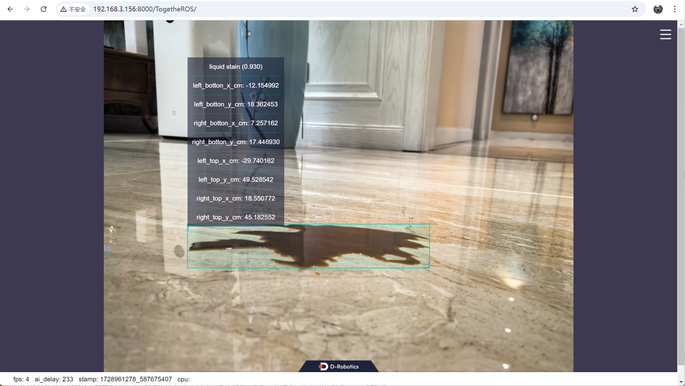

# 一、功能介绍

在`X5`平台上（`RDK X5`或`X5 EVB`）运行gRPC server和client。client端将图片发送到server端，server端经过算法推理后将图片对应的感知结果发送到client端，同时在PC的WEB端渲染图片和感知结果。

# 二、准备工作

## 1. X5开发板

根据开发板类型进行相应配置。

**RDK X5**

- [参考手册](https://developer.d-robotics.cc/rdk_doc/Robot_development/quick_start/preparation)，RDK已烧录好Ubuntu系统镜像，已成功安装tros.b。

- [参考手册](https://developer.d-robotics.cc/rdk_doc/System_configuration/network_blueteeth#station%E6%A8%A1%E5%BC%8F)，连接WIFI。

**X5 EVB**

- [参考手册](https://horizonrobotics.feishu.cn/docx/EgV8doolDo2kluxbo2BcJyoSnde)，安装`ROS2 humble`和`tros.b`。

- [参考手册](http://sysgbj2.hobot.cc/x5/cn/linux_development/driver_develop_guide/33-WIFI_Driver_Debug_Guide.html#id5)，连接WIFI：`wifi_connect [ssid] [password]`，其中`ssid`为WIFI名称，`password`为WIFI密码。例如：`wifi_connect "WiFi-Test" "12345678"`。

- 配置nginx参数：

  ```bash
  sed -i 's/# user  nobody;/user  nobody/g' /opt/tros/humble/lib/websocket/webservice/conf/nginx.conf
  ```

## 2. 部署gRPC server

将部署包[下载](https://archive.d-robotics.cc/TogetheROS/files/tros_bridge_grpc.tar.gz)后拷贝到板端`/userdata/`路径下，解压缩：

```bash
cd /userdata/
tar -zxvf tros_bridge_grpc.tar.gz -C /userdata/
```

## 3. 部署感知算法

[参考手册](https://horizonrobotics.feishu.cn/docx/JEG8dob8ioB7R2xBWzYc0eyOn5d)，部署感知算法应用。

# 三、运行

## 终端1，启动感知算法

**注意**，以下命令以算法安装在`/userdata`路径下举例。

```bash
# 依赖ros
source /opt/ros/humble/setup.bash
cd /userdata
export ROS_LOG_DIR=./.ros/log
export LD_LIBRARY_PATH=/opt/ros/humble/lib:/userdata/deps:/opt/tros/humble/lib:/usr/hobot/lib:sysroot_docker/usr_x5/lib:sysroot_docker/usr_x5/lib/aarch64-linux-gnu/

# 依赖解压安装包
source install/setup.bash

# 复制模型文件
cp -r install/lib/hobot_yolo_world/config .

# 运行程序
ros2 launch hobot_yolo_world yolo_world_advance.launch.py smart_topic:=/hobot_yolo_world
```

## 终端2，启动gRPC server

**注意**，如果`gRPC client`不是`X5`，使用`X5`的实际`IP`地址替换以下命令中的`localhost:2510`。

```bash
source /opt/tros/humble/setup.bash
source /userdata/tros_bridge_grpc/install/local_setup.bash

cd /userdata
export ROS_LOG_DIR=./.ros/log
export LD_LIBRARY_PATH=/opt/ros/humble/lib:/userdata/deps:/opt/tros/humble/lib:/usr/hobot/lib:sysroot_docker/usr_x5/lib:sysroot_docker/usr_x5/lib/aarch64-linux-gnu/

ros2 run tros_bridge_grpc grpc_server --ros-args -p smart_topic:=/hobot_yolo_world -p is_sync_mode:=1 -p server_address:=localhost:2510 --log-level info
```

## 终端3，启动gRPC client，发送图片

```bash
source /opt/tros/humble/setup.bash
source /userdata/tros_bridge_grpc/install/local_setup.bash

cd /userdata
export ROS_LOG_DIR=/userdata/.ros/log
export LD_LIBRARY_PATH=/opt/ros/humble/lib:/userdata/deps:/opt/tros/humble/lib:/usr/hobot/lib:sysroot_docker/usr_x5/lib:sysroot_docker/usr_x5/lib/aarch64-linux-gnu/

ros2 run tros_bridge_grpc sample_client localhost:2510 `ros2 pkg prefix tros_bridge_grpc`/share/tros_bridge_grpc/config/yolo_world_test.jpg 1
```

# 四、结果展示

在PC端的浏览器输入url`http://IP:8000`，即可查看图像和算法渲染效果（IP为RDK的IP地址）：



3个终端（左上是感知算法输出，右上是gRPC server，左下是gRPC client）输出如下log：


# 五、RDK X5平台上编译gRPC server

## 1. 部署gRPC库及其依赖包

使用预编译包安装：

```bash
cd /userdata/
wget https://archive.d-robotics.cc/TogetheROS/files/install_grpc_arm64-20241014.tar.gz
tar -zxvf install_grpc_arm64-20241014.tar.gz
cd install_grpc_arm64/
sudo cp -r cmake/* /usr/local/lib/cmake/
sudo cp lib/* /usr/local/lib/
sudo cp bin/* /usr/local/bin/
sudo cp -r include/* /usr/local/include/
```

预编译包的编译方法参考预编译包中的安装说明`install_grpc_arm64/install.md`。

## 2. 安装ROS2编译工具

```shell
sudo apt install ros-dev-tools
```

## 3. 下载代码和编译

```bash
mkdir -p /userdata/tros/src; cd /userdata/tros/src
git clone https://github.com/D-Robotics/tros_bridge_grpc.git
cd /userdata/tros/
colcon build --packages-select tros_bridge_grpc
```
